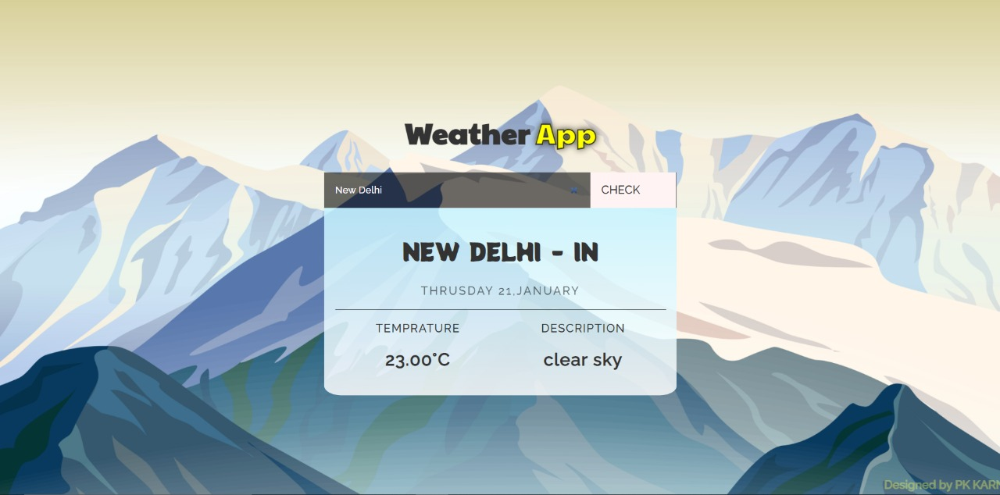

## Weather App Project [Live](https://vuepk.herokuapp.com/)
---
It's vuejs 2.x project, where I fetched weather data from [openweathermap](https://openweathermap.org/api). I've used vuex for state management.
### How to run this project
---
First of all install node(npm) and then clone this repository into your local computer by using:
```
git clone https://github.com/pkkarn/vue_weather.git
```
And then get inside vue_weather directory and then install all dependencies 

```sh
$ cd vue_weather
$ npm install
$ npm run serve
```

The above command will open the live project at [localhost:8080](http://localhost:8080/)
